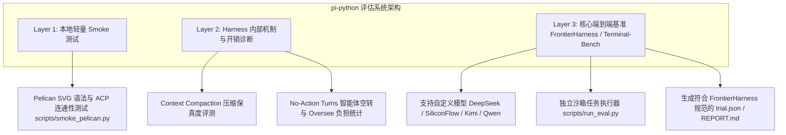

# FrontierHarness Eval 评估系统接入指南

`pi-python` 现已内置面向 **FrontierHarness Eval** 与 **Terminal-Bench** 的代码智能体（Code Agent Harness）端到端综合评估框架。

该评估框架能够评测固定模型（支持 DeepSeek / SiliconFlow / Qwen / Claude / Kimi 等自定义模型）在 `pi-python` Agent Harness 驱动下的**真实任务解决率（Pass Rate）**、**有效单题成本（Effective Cost per Pass）**、**Prompt Cache 命中率**、**交互轮次（Turns）**与**空转轮次（No-Action Turns）**。

---

## 1. 评估系统三层分级架构



- **Layer 1: 轻量连通性冒烟**：`scripts/smoke_pelican.py`，单轮验证 ACP 协议与工具链连通性。
- **Layer 2: Harness 内部开销诊断**：跟踪上下文压缩率、Prompt Cache 命中率、以及智能体思考未执行动作的空转轮次（No-Action Turns）。
- **Layer 3: 核心端到端任务基准**：直接兼容 `frontier-harness-eval`（30 个任务）与 `terminal-bench-2-1`，全自动完成“初始化环境 -> 启动 Harness 交互 -> 执行测试验证 -> 生成指标报告”。

---

## 2. 评测指标与记录规范（Contract）

本系统产出的结果与 [frontier-harness-eval/eval](https://github.com/frontier-harness-eval/eval) 的 `trial.json` 规范完全对齐：

| 字段 | 含义 | 说明 |
| :--- | :--- | :--- |
| `id` | 任务全称 | 如 `terminal-bench/regex-log` |
| `status` | 执行状态 | `success` / `failure` / `error` / `infra_invalid`（仅当 `total_turns == 0` 时允许标记为 `infra_invalid`） |
| `success` | 是否通过 | 基于任务对应的自动化验证器（Verifier）最终判定 |
| `duration_seconds` | 耗时（秒） | 任务从开始到完成的实际墙钟时间 |
| `turns` | 总交互轮数 | Harness 与模型交互的 Turn 总数 |
| `no_action_turns` | 无动作轮数 | 模型仅产生推理思考或文本而未调用任何文件/命令工具的轮数 |
| `cache_hit_rate_normalized`| Cache 命中率 | 排除首轮冷启动缓存后的归一化命中率 |
| `cost_first_cold_usd` | 单任务实际开销 | 首轮缓存按冷启动重新计费后的实际折算成本（USD） |
| `cost_kimi_k3_normalized_usd` | 官方标准对标开销 | 基于官方 Kimi K3 基准价格表（$3/$0.3/$15）折算的标准化成本 |
| `input_tokens` / `output_tokens` / `cached_tokens` | Token 计数统计 | 细分输入、输出与缓存 Token |

---

## 3. 快速上手

### 3.1 环境变量与模型配置

评估脚本默认使用 `~/.pi-python/agent.toml` 中的配置，并从环境变量中获取 API Key：

```powershell
# 引入本地密钥与配置（Windows PowerShell）
. $env:USERPROFILE\.pi-python\local.env.ps1

# 验证 Key 已注入
$env:REAL_LLM_API_KEY
```

支持的模型配置在 `~/.pi-python/agent.toml`：
```toml
[model]
provider = "deepseek"
id = "deepseek-ai/DeepSeek-V4-Flash"
base_url = "https://api.siliconflow.cn/v1"
api_key_env = "REAL_LLM_API_KEY"
```

### 3.2 运行评测任务

#### 运行单个内置任务（如 Terminal-Bench #1: regex-log）
```powershell
.venv\Scripts\python.exe scripts/run_eval.py --task regex-log
```

#### 运行所有内置任务
```powershell
.venv\Scripts\python.exe scripts/run_eval.py --all
```

#### 运行外部 FrontierHarness / Terminal-Bench 任务集
```powershell
# 指定外部任务目录
.venv\Scripts\python.exe scripts/run_eval.py --tasks-dir .cache/terminal-bench-2-1/tasks --task regex-log
```

#### 在 WSL 中使用 Docker 容器沙箱运行（支持 DeepSWE 与工业级环境）
```powershell
# 在 WSL 中使用 Docker 运行单个任务（自动拉取镜像并挂载沙箱）
wsl bash -lc "cd /mnt/d/work/pi-python && /tmp/pi-eval-venv/bin/python scripts/run_eval.py --frontier-30 --task regex-log"

# 运行 DeepSWE 开源仓库任务（自动在真实容器中运行 SWE-bench 完整测试套件）
wsl bash -lc "cd /mnt/d/work/pi-python && /tmp/pi-eval-venv/bin/python scripts/run_eval.py --frontier-30 --task fastapi-deprecation-response-headers"
```

#### 自定义参数与高级选项
```powershell
# 限制单任务最大轮次为 15，并指定自定义运行 ID
.venv\Scripts\python.exe scripts/run_eval.py --task calc-eval --max-turns 15 --run-id my-first-eval

# 显式禁用 Docker，使用宿主机本地执行（本地轻量测试）
.venv\Scripts\python.exe scripts/run_eval.py --frontier-30 --task regex-log --no-docker

# 指定网络出站隔离模式（auto / no-network / allowlist / open）
.venv\Scripts\python.exe scripts/run_eval.py --frontier-30 --task regex-log --egress-mode allowlist
```

### 3.3 本地化黄金快照（Golden Checkpoint）机制

为了彻底消除测试间的跨任务文件污染、Page Cache 预热偏差与多次拉取解包带来的时间浪费，评测系统提供了本地化黄金快照与秒级还原体系：

#### 1. 一键固化构建黄金种子（Golden Seed Provisioning）
运行一次 `--provision`，评测系统会拉取所有评测任务 Docker 镜像并将其初始 `/app` 代码提取到只读种子目录中，同时生成环境指纹 `golden-manifest.json`：
```powershell
# 固化构建全部 FrontierHarness 30 题的工作区种子快照
wsl bash -lc "cd /mnt/d/work/pi-python && /tmp/pi-eval-venv/bin/python scripts/run_eval.py --frontier-30 --provision --seeds-dir /tmp/pi-golden-seeds"
```

#### 2. 秒级 CoW (Copy-on-Write) 纯净还原
当种子目录就绪后，每次执行评测任务时：
- 系统优先调用 Linux ext4 文件的 `cp -a --reflink=auto`，实现**零耗时、零额外磁盘占用**的秒级全新工作区初始化；
- 若未预先执行 `--provision`，系统会自动平滑降级至 `docker create` + `docker cp` 的即时提取路径。

### 3.4 网络出站隔离策略（Egress Policy Guard）

系统严格对齐官方 `frontier-harness-eval`（PR #7 & PR #11）的网络规范：

- **`no-network` 严格断网**：对于 DeepSWE 等工业级任务（`network_mode: "no-network"`），容器启动时自动附加 `--network none`，容器内无法访问公网；Agent 与 LLM 交互由宿主机 `pi-python` 代理驱动。
- **`allowlist` 白名单放行**：对于 Terminal-Bench 任务，通过透明代理放行官方 15 个域名白名单（包含 `astral.sh`、`github.com`、`pypi.org`、`*.ecr.aws` 等），保障基础依赖包安装的同时杜绝未经授权的网络访问。
- 支持通过 `--egress-mode` 手动覆盖（`auto`、`no-network`、`allowlist`、`open`）。

---

## 4. 产出报告与诊断证据

每次评测会在 `.pi-eval/runs/<run_id>/` 下输出完整证据链路：

```text
.pi-eval/runs/20260904-083153/
├── run.json                 # 官方规范环境指纹清单（记录 Git commit、Egress 策略、硬件规格与标准归一化成本）
├── eval-summary.json        # 汇总评测结果（含所有题目的聚合指标）
├── REPORT.md                # 格式化 Markdown 评测报告与数据表格
└── trials/
    └── regex-log/
        ├── trial.json       # 符合 FrontierHarness 规范的单题记录
        ├── trajectory.json  # 完整的智能体思考过程、工具调用与结果轨迹
        ├── verifier_output.txt # Pytest / Verifier 执行输出详细日志
        └── workspace/       # 智能体工作目录生成的代码与文件快照
```

### 真实模型运行实测样例

以下为在 `deepseek-ai/DeepSeek-V4-Flash` 模型下的实测运行报告：

```markdown
# Benchmark Evaluation Report: 20260904-083153

- **Harness**: `pi-python`
- **Model**: `deepseek-ai/DeepSeek-V4-Flash` (deepseek)
- **Time**: `2026-09-04T08:31:53Z` to `2026-09-04T08:35:24Z`
- **Tasks**: 1 / 1 passed (100.0%)

## Key Metrics

| Metric | Value | Meaning |
| :--- | :--- | :--- |
| **Pass Rate** | **100.0%** | Tasks successfully solved and verified |
| **Effective Cost / Pass** | **$0.1117** | Total amortized cost per passed task |
| **Tokens / Solved** | **319,794** | Amortized tokens consumed per passed task |
| **Total Cost** | $0.1117 | Total API spend for the run |
| **Typical Cache Hit Rate** | 45.8% | Prompt caching efficiency |
| **Mean Turns** | 13.0 | Average interaction turns per task |
| **Mean No-Action Turns** | 1.0 | Turns without file/shell operations (overhead) |
| **Median Duration** | 209.2s | Median elapsed time per task |

## Task Results

| Status | Task ID | Duration | Turns (No-Act) | Tokens | Cache | Cost |
| :---: | :--- | :---: | :---: | :---: | :---: | :---: |
| ✅ | `terminal-bench/regex-log` | 209.2s | 13 (1) | 319,794 | 46% | $0.1117 |
```
