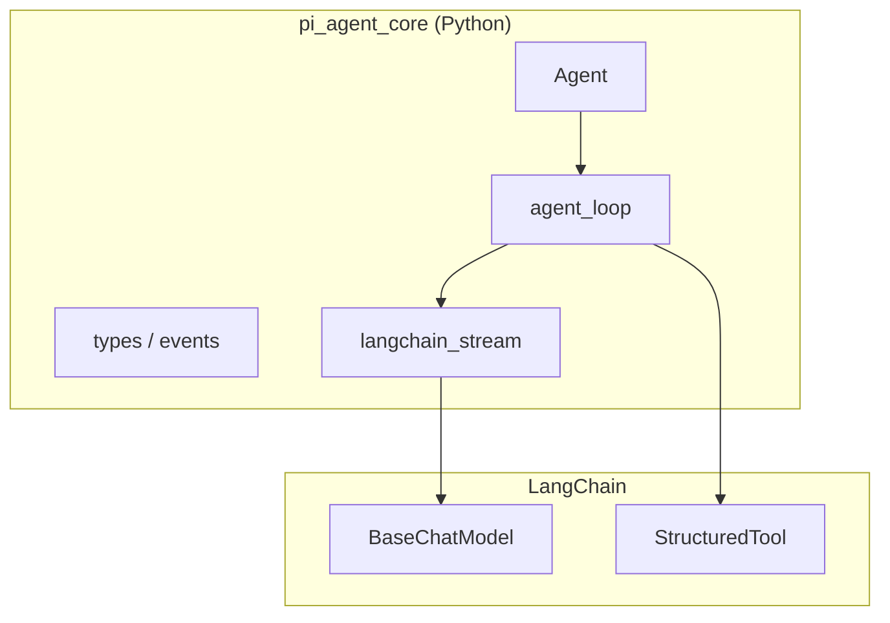
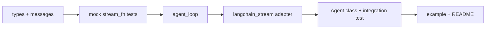

# pi-agent-core Python 实现计划

> **历史文档**（Phase 1 规划原稿）。Phase 1/2/2.5 均已完成；当前状态与后续路线以
> `docs/AUDIT-2026-07-02.md`（审计与增强追踪）和 README 为准。本文中 "Phase 2"
> 指生产化增强（已完成），"Phase 3" 指 AgentHarness（待启动）。

## 调研结论

[earendil-works/pi](https://github.com/earendil-works/pi) 是 TypeScript monorepo，与 agent 相关的核心包：


| 包                 | 路径                            | 职责                                       |
| ----------------- | ----------------------------- | ---------------------------------------- |
| **pi-ai**         | `packages/ai/`                | 统一 LLM API：多厂商、流式事件、工具 schema 校验         |
| **pi-agent-core** | `packages/agent/`             | Agent 运行时：状态、事件流、工具循环、steering/follow-up |
| **AgentHarness**  | `packages/agent/src/harness/` | 会话树 JSONL、Compaction、Skills、Hooks（可选上层）  |


当前工作区 `[/workspace](/workspace)` 仅有 `[README.md](/workspace/README.md)` 桩（`pi-python`），需从零搭建。

**默认范围（若你未另行指定）：**

- **MVP**：仅 pi-agent-core 核心（`Agent` + `agent-loop`）
- **集成方式**：忠实移植 pi 的事件协议与循环语义；LangChain 只作 `StreamFn` / 工具绑定适配层（不用 LangGraph 替代主循环）




---

## pi-agent-core 核心架构（需移植的部分）

### 三层结构

1. **低层 `agent-loop`**（`[packages/agent/src/agent-loop.ts](https://github.com/earendil-works/pi/blob/main/packages/agent/src/agent-loop.ts)`）
  - 外层循环：follow-up 消息注入
  - 内层循环：LLM 流式响应 → 工具执行 → steering 轮询
  - 事件顺序是 UI 契约，必须严格保持（见 [agent README](https://github.com/earendil-works/pi/blob/main/packages/agent/README.md)）
2. **中层 `Agent` 类**（`[packages/agent/src/agent.ts](https://github.com/earendil-works/pi/blob/main/packages/agent/src/agent.ts)`）
  - `AgentState`、`prompt()` / `continue()` / `abort()`
  - steering / follow-up 队列（`one-at-a-time` | `all`）
  - `subscribe()` 监听器按序 await，`agent_end` 为 settlement 屏障
3. **高层 Harness**（Phase 2，本次 MVP 不实现）
  - Session JSONL 树、Compaction、Skills、多 phase 锁

### 消息流水线（pi 的设计精髓）

```
AgentMessage[] → transformContext() → AgentMessage[] → convertToLlm() → LLM Message[]
```

- **AgentMessage**：应用层 transcript（可含自定义 role）
- **convertToLlm**：必填，过滤 UI 专用消息
- LangChain 侧：在 `convert_to_llm` 之后映射为 `HumanMessage` / `AIMessage` / `ToolMessage`

### 对 pi-ai 的依赖边界（LangChain 替换点）


| pi-ai 能力                          | Python 替代                                                |
| --------------------------------- | -------------------------------------------------------- |
| `streamSimple` / `StreamFn`       | `BaseChatModel.astream()` + 自定义事件适配器                     |
| `Message` / `Context`             | Pydantic dataclass + LangChain `BaseMessage` 互转          |
| `validateToolArguments` (TypeBox) | Pydantic `model_validate` on tool args                   |
| `AssistantMessageEventStream`     | `asyncio` 队列或 async generator                            |
| 多厂商 registry / OAuth              | `langchain-openai`、`langchain-anthropic` 等 + env API key |
| `transformMessages` 跨厂商回放         | **Phase 1 简化**；换模型时 Phase 2 再 port                       |


**不移植 pi-ai**：`models.generated.ts`、各 provider SSE 解析、OAuth 细节。

---

## 推荐包结构

在 `/workspace` 新建：

```
pi_agent_core/
├── __init__.py              # 导出 Agent, agent_loop, 主要类型
├── types.py                 # AgentState, AgentEvent, AgentTool, AgentLoopConfig
├── messages.py              # pi 风格 Message / ContentBlock（与 LC 解耦）
├── agent_loop.py            # run_agent_loop, stream_assistant_response, execute_tool_calls
├── agent.py                 # Agent 类
├── queues.py                # PendingMessageQueue (steering/follow-up)
├── adapters/
│   ├── __init__.py
│   ├── langchain_stream.py  # StreamFn: LC astream → pi 风格 AssistantMessageEvent
│   └── langchain_convert.py # convert_to_langchain / from_langchain
└── tests/
    ├── test_agent_loop.py   # mock stream_fn，无真实 API
    └── test_agent.py

pyproject.toml                 # Python >=3.11, langchain-core, langchain-openai, pydantic
examples/
    minimal_agent.py           # 单文件可运行示例
```

---

## Phase 1：MVP（核心运行时）

### 1.1 类型与消息模型 [`types.py`, `messages.py`]

对齐 pi 的 canonical 形状（便于日后对接 pi 文档/UI）：

- `UserMessage`, `AssistantMessage`, `ToolResultMessage`
- Content blocks: `text`, `thinking`（可选）, `toolCall`, `image`
- `AgentEvent` 联合类型：`agent_start/end`, `turn_start/end`, `message_*`, `tool_execution_*`
- `AssistantMessageEvent`：`text_delta`, `toolcall_delta`, `done`, `error` 等
- `AgentTool`：`name`, `description`, `parameters`（Pydantic model 或 JSON schema dict）, `execute()`, `execution_mode`, `label`
- `AgentLoopConfig`：`model`, `convert_to_llm`, `transform_context`, hooks, `tool_execution`, `stream_fn`

`Model` 配置用轻量 dataclass（不必复制 pi 全量 catalog）：

```python
@dataclass
class Model:
    provider: str      # "openai", "anthropic"
    model_id: str
    # 可选: context_window, supports_images, reasoning
```

### 1.2 LangChain 适配层 [`adapters/langchain_stream.py`]

`**StreamFn` 签名**（与 pi 注入点一致）：

```python
async def stream_fn(
    model: Model,
    context: AgentContext,
    options: StreamOptions,
) -> AsyncIterator[AssistantMessageEvent]:
    ...
```

实现要点：

- `resolve_chat_model(model)` → `ChatOpenAI` / `ChatAnthropic`（通过 `init_chat_model` 或工厂）
- `messages = convert_to_langchain(context.messages)`；`system` → `SystemMessage` 或 `model` 的 system 参数
- `bound = chat_model.bind_tools(tools)` when tools present
- `async for chunk in bound.astream(messages)`：
  - `chunk.content` → `text_delta`
  - `chunk.tool_call_chunks` → `toolcall_delta`（需累积 partial JSON，可参考 pi 的 `parseStreamingJson` 思路）
  - 结束 → `done` + 组装 `AssistantMessage`（含 `stop_reason`: `stop` | `toolUse`）
- 异常/取消 → `error` 事件（**不向外抛**，与 pi-ai 一致）

**工具定义**：`AgentTool` → `StructuredTool.from_function` 或手写 `args_schema: BaseModel`；执行仍走 agent-loop 的 `execute()`，而非 LangChain `ToolNode`（保持 pi 语义）。

### 1.3 Agent 循环 [`agent_loop.py`]

按 pi `[agent-loop.ts](https://github.com/earendil-works/pi/blob/main/packages/agent/src/agent-loop.ts)` 移植：


| 行为                                           | 必须保留                                            |
| -------------------------------------------- | ----------------------------------------------- |
| 工具 preflight → validate → `before_tool_call` | 可 block，生成 `is_error` tool result               |
| 并行/顺序执行                                      | 全局 `tool_execution` + 单工具 `execution_mode` 覆盖规则 |
| `terminate: true`                            | 仅当批次内**全部**工具结果 terminate 时跳过下一轮 LLM            |
| steering                                     | turn 结束后注入，开启新 turn                             |
| follow-up                                    | 无 tool/steering 时外层循环注入                         |
| `should_stop_after_turn`                     | turn_end 后优雅退出                                  |
| `message_end` 屏障                             | 仅 `Agent` 类保证（非 raw loop）                       |


提供：

- `async def agent_loop(prompts, context, config) -> AsyncIterator[AgentEvent]`
- `async def agent_loop_continue(context, config) -> ...`
- `async def run_agent_loop(..., emit: Callable)` — `Agent` 内部使用

### 1.4 Agent 类 [`agent.py`]

移植 `[agent.ts](https://github.com/earendil-works/pi/blob/main/packages/agent/src/agent.ts)`：

- `prompt(text | messages, images?)`, `continue()`, `abort()`, `wait_for_idle()`, `reset()`
- `steer()`, `follow_up()`, 队列清理
- `subscribe(listener)` — async，按注册顺序 await
- `is_streaming` 在 `agent_end` 监听器全部完成后才清零

### 1.5 测试策略

镜像 pi 的 `[packages/agent/test/agent-loop.test.ts](https://github.com/earendil-works/pi/blob/main/packages/agent/test/agent-loop.test.ts)`：

- **Mock `stream_fn`**：返回预设 `text_delta` / `toolcall_*` / `done`，无需 API key
- 断言事件序列：纯对话、单/多工具、parallel vs sequential、steering、follow-up、abort、`should_stop_after_turn`
- 工具失败：execute 抛错 → `is_error=True` 的 tool result

### 1.6 示例与依赖

`**pyproject.toml` 建议依赖：**

- `langchain-core`（`BaseChatModel`, messages, tools）
- `langchain-openai`, `langchain-anthropic`（按你常用厂商选 1–2 个起步）
- `pydantic>=2`
- 开发：`pytest`, `pytest-asyncio`

`**examples/minimal_agent.py`：**

```python
agent = Agent(initial_state={...}, convert_to_llm=default_filter)
agent.subscribe(print_event)
await agent.prompt("Hello")
```

---

## Phase 2：生产化增强


| 模块                           | 说明                                                   |
| ---------------------------- | ---------------------------------------------------- |
| **自定义 AgentMessage**         | TypedDict / Protocol + `convert_to_llm` 扩展点          |
| **transform_context**        | 消息裁剪、token 估算钩子                                      |
| **跨模型 `transform_messages`** | port pi-ai 逻辑（tool call ID 规范化、thinking 降级）— 换模型场景必需 |
| **thinking / reasoning**     | 映射 provider 的 reasoning 字段到 `thinking` content block |
| **Usage / cost**             | 从 `response_metadata` / `usage_metadata` 聚合          |
| **stream_proxy**             | 浏览器后端代理（可选）                                          |


---

## Phase 3：AgentHarness（可选）

若需要 pi coding agent 级能力，再 port：

- `[harness/agent-harness.ts](https://github.com/earendil-works/pi/blob/main/packages/agent/src/harness/agent-harness.ts)` — Session 树、phase 锁
- JSONL session repo、compaction（LangChain 摘要链）、Skills（`SKILL.md` + yaml frontmatter）
- 工作量大，建议在核心 loop 稳定且有自己的用例后再做

---

## 与 LangGraph 的关系

- **MVP 不用 LangGraph 替代主循环**：pi 的 steering/follow-up、`terminate`、事件屏障是定制语义，LangGraph 的 `create_react_agent` 无法 1:1 映射
- **后续扩展**：多 agent 协作、持久 checkpoint、人工审批节点可用 LangGraph **包裹**现有 `Agent`，而非替换 `agent_loop`

---

## 实现顺序（建议）




---

## 风险与缓解


| 风险                                              | 缓解                                              |
| ----------------------------------------------- | ----------------------------------------------- |
| LC 流式 chunk 形态因厂商而异                             | 适配器内按 provider 分支；先支持 OpenAI + Anthropic        |
| 事件顺序回归                                          | 以 pi test 用例为 golden sequence                   |
| 并行工具 `tool_execution_end` 顺序 vs toolResult 持久顺序 | 严格按 pi README：end 按完成顺序，message 按 assistant 源顺序 |
| 跨厂商换模型上下文损坏                                     | Phase 1 文档注明限制；Phase 2 port transform_messages  |


---

## 交付物

1. 可安装的 `pi_agent_core` 包（`pip install -e .`）
2. 通过 mock 测试的 `Agent` + `agent_loop`
3. 一个 LangChain 真实调用示例（需用户配置 `OPENAI_API_KEY` 等）
4. README：架构图、与 pi 的概念对照表、Phase 2/3 路线图


